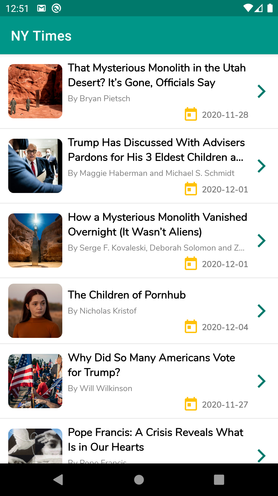
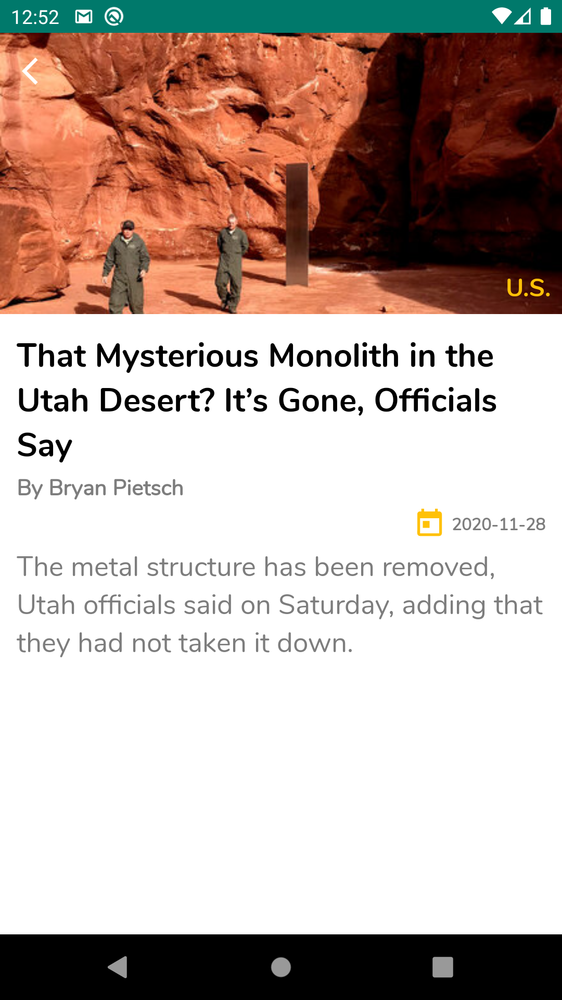
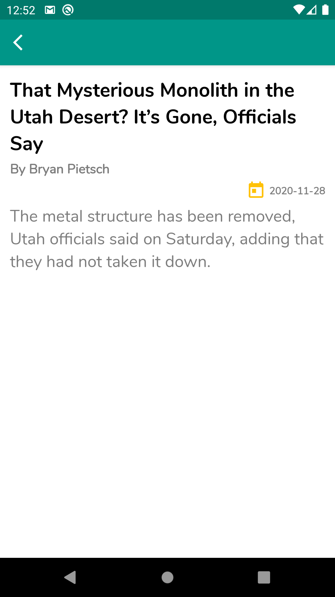
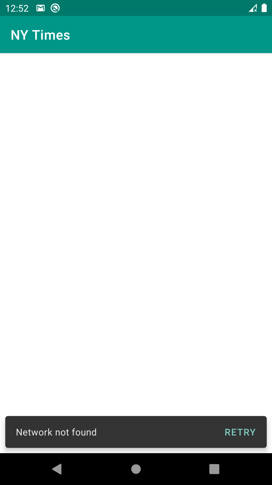

# Ny Times 

Android app lets you explore the new york times most popular articles in an easy way

## About the project

- **Kotlin**
- **MVVM**
- **Clean Architecture**
- **Kotlin Coroutines**
- **Koin for dependency injection**
- **Retrofit2, Okhttp4, Moshi and Glide**
- **Android Material Design Components**

## SonarQube
**to run SonarQube code analysis please do the following**

- first install and run [**SonarQube**](https://docs.sonarqube.org/latest/setup/install-server/) in your machine
- open **SonarQube** admin panel
- add new project with project name as **NyTimes** and project key as **com.beshoy.nytimes**
- open the project in Android Studio
- open the project terminal
- run **gradlew sonar**
